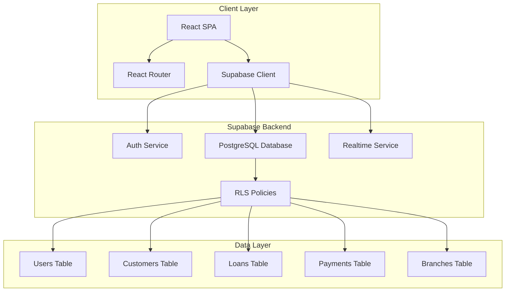

# Design Document

## Overview

Millennium Potter is a React-based fintech web application with Supabase backend integration. The architecture follows a role-based access control (RBAC) pattern with three distinct user types: Admin, Sub-Admin, and Agent. The system implements branch-specific data segregation through Supabase Row Level Security (RLS) policies and provides real-time updates via Supabase subscriptions.

The application features a premium banking aesthetic with glassmorphism effects, bank building backgrounds, and floating multi-currency animations. The tech stack includes React with TypeScript, Tailwind CSS for styling, Supabase for backend services, and React Router for navigation.

## Architecture

### High-Level Architecture



### Application Structure

```
millennium-potter/
├── src/
│   ├── components/
│   │   ├── layout/
│   │   │   ├── AdminLayout.tsx
│   │   │   ├── SubAdminLayout.tsx
│   │   │   ├── AgentLayout.tsx
│   │   │   └── AuthLayout.tsx
│   │   ├── shared/
│   │   │   ├── Navbar.tsx
│   │   │   ├── Sidebar.tsx
│   │   │   ├── Card.tsx
│   │   │   ├── Table.tsx
│   │   │   ├── Modal.tsx
│   │   │   └── LoadingSpinner.tsx
│   │   ├── dashboard/
│   │   │   ├── StatsCard.tsx
│   │   │   ├── ChartWidget.tsx
│   │   │   └── RecentActivity.tsx
│   │   ├── payments/
│   │   │   ├── WeeklyPaymentGrid.tsx
│   │   │   ├── PaymentCell.tsx
│   │   │   └── PaymentSummary.tsx
│   │   └── forms/
│   │       ├── CustomerForm.tsx
│   │       ├── GuarantorForm.tsx
│   │       └── LoanApplicationForm.tsx
│   ├── pages/
│   │   ├── auth/
│   │   │   ├── Login.tsx
│   │   │   └── ForgotPassword.tsx
│   │   ├── admin/
│   │   │   ├── Dashboard.tsx
│   │   │   ├── BranchComparison.tsx
│   │   │   ├── AllUsers.tsx
│   │   │   ├── AllLoans.tsx
│   │   │   ├── AllTransactions.tsx
│   │   │   └── Reports.tsx
│   │   ├── subadmin/
│   │   │   ├── Dashboard.tsx
│   │   │   ├── AgentManagement.tsx
│   │   │   ├── CustomerPortfolio.tsx
│   │   │   ├── LoanApprovals.tsx
│   │   │   └── BranchAnalytics.tsx
│   │   └── agent/
│   │       ├── Dashboard.tsx
│   │       ├── CustomerRegistration.tsx
│   │       ├── LoanApplication.tsx
│   │       ├── WeeklyPaymentSheet.tsx
│   │       └── Performance.tsx
│   ├── services/
│   │   ├── supabase.ts
│   │   ├── authService.ts
│   │   ├── customerService.ts
│   │   ├── loanService.ts
│   │   ├── paymentService.ts
│   │   └── analyticsService.ts
│   ├── hooks/
│   │   ├── useAuth.ts
│   │   ├── useRealtime.ts
│   │   ├── useCustomers.ts
│   │   ├── useLoans.ts
│   │   └── usePayments.ts
│   ├── contexts/
│   │   ├── AuthContext.tsx
│   │   └── ThemeContext.tsx
│   ├── types/
│   │   ├── user.ts
│   │   ├── customer.ts
│   │   ├── loan.ts
│   │   └── payment.ts
│   ├── utils/
│   │   ├── formatters.ts
│   │   ├── validators.ts
│   │   └── constants.ts
│   └── App.tsx
```

## Components and Interfaces

### Authentication System

**AuthContext**
- Manages global authentication state
- Provides user session, role, and branch information
- Handles login, logout, and session persistence
- Implements protected route logic based on user role

**Login Flow**
1. User enters credentials
2. Supabase Auth validates credentials
3. Fetch user profile with role and branch from `users` table
4. Store session in AuthContext
5. Redirect to appropriate dashboard based on role

### Role-Based Routing

```typescript
interface UserProfile {
  id: string;
  email: string;
  role: 'admin' | 'subadmin' | 'agent';
  branch_id: string | null;
  branch_name: 'Igando' | 'Abule-Egba' | null;
  full_name: string;
  phone: string;
  created_at: string;
}

interface ProtectedRouteProps {
  allowedRoles: UserProfile['role'][];
  children: React.ReactNode;
}
```

Routes are protected based on user role:
- `/admin/*` - Admin only
- `/subadmin/*` - Sub-Admin only
- `/agent/*` - Agent only

### Dashboard Components

**Admin Dashboard (15+ Pages)**
- Global overview with KPIs from both branches
- Branch comparison charts (loans, collections, customers)
- User management table with role assignment
- Loan management with filtering and search
- Transaction monitoring with real-time updates
- Advanced reporting with date range filters
- Data export functionality (CSV, PDF)

**Sub-Admin Dashboard (12+ Pages)**
- Branch-specific overview with KPIs
- Agent management (add, edit, view performance)
- Customer portfolio with search and filters
- Loan approval queue with review interface
- Branch analytics with trend charts
- Payment collection reports
- Agent performance leaderboard

**Agent Dashboard (10+ Pages)**
- Personal performance metrics
- Customer registration form with guarantor section
- Loan application wizard
- Weekly payment tracking grid
- Daily collection interface
- Customer list with search
- Loan status tracking
- Target vs achievement display

### Weekly Payment Tracking Grid

**Component Structure**
```typescript
interface PaymentGridProps {
  agentId: string;
  branchId: string;
  weekStartDate: Date;
}

interface PaymentCell {
  customer_id: string;
  date: Date;
  amount_due: number;
  amount_paid: number;
  status: 'paid' | 'unpaid' | 'partial' | 'overdue';
  payment_id: string | null;
}
```

**Features**
- Grid layout with customers as rows, days (Mon-Sat) as columns
- Touch-optimized checkboxes for mobile use
- Color coding: Green (paid), Red (overdue), Yellow (partial), Gray (unpaid)
- Real-time sync with Supabase
- Offline capability with local storage fallback
- Swipe gestures for mobile navigation

### Customer and Guarantor Forms

**Customer Registration**
```typescript
interface Customer {
  id: string;
  full_name: string;
  phone: string;
  email: string | null;
  address: string;
  id_type: 'NIN' | 'BVN' | 'Drivers License' | 'Voters Card';
  id_number: string;
  branch_id: string;
  agent_id: string;
  created_at: string;
}

interface Guarantor {
  id: string;
  customer_id: string;
  full_name: string;
  phone: string;
  address: string;
  relationship: string;
  id_type: string;
  id_number: string;
}
```

Multi-step form with validation:
1. Customer personal information
2. Customer identification details
3. Guarantor information (minimum 1, maximum 3)
4. Review and submit

### Loan Management

**Loan Application Flow**
```typescript
interface Loan {
  id: string;
  customer_id: string;
  agent_id: string;
  branch_id: string;
  subadmin_id: string;
  amount: number;
  interest_rate: number;
  duration_weeks: number;
  weekly_payment: number;
  status: 'pending' | 'approved' | 'rejected' | 'active' | 'completed' | 'defaulted';
  application_date: string;
  approval_date: string | null;
  approved_by: string | null;
  rejection_reason: string | null;
}
```

**Workflow**
1. Agent submits loan application
2. System calculates weekly payment based on amount, interest, and duration
3. Loan enters pending status
4. Sub-Admin receives notification
5. Sub-Admin reviews customer, guarantor, and loan details
6. Sub-Admin approves or rejects with comments
7. Agent receives notification of decision
8. If approved, loan becomes active and appears in payment tracking

## Data Models

### Database Schema

```sql
-- Branches Table
CREATE TABLE branches (
  id UUID PRIMARY KEY DEFAULT uuid_generate_v4(),
  name TEXT NOT NULL UNIQUE,
  address TEXT,
  phone TEXT,
  created_at TIMESTAMPTZ DEFAULT NOW()
);

-- Users Table (extends Supabase auth.users)
CREATE TABLE users (
  id UUID PRIMARY KEY REFERENCES auth.users(id),
  email TEXT NOT NULL UNIQUE,
  role TEXT NOT NULL CHECK (role IN ('admin', 'subadmin', 'agent')),
  branch_id UUID REFERENCES branches(id),
  full_name TEXT NOT NULL,
  phone TEXT NOT NULL,
  created_at TIMESTAMPTZ DEFAULT NOW(),
  updated_at TIMESTAMPTZ DEFAULT NOW()
);

-- Customers Table
CREATE TABLE customers (
  id UUID PRIMARY KEY DEFAULT uuid_generate_v4(),
  full_name TEXT NOT NULL,
  phone TEXT NOT NULL,
  email TEXT,
  address TEXT NOT NULL,
  id_type TEXT NOT NULL,
  id_number TEXT NOT NULL,
  branch_id UUID NOT NULL REFERENCES branches(id),
  agent_id UUID NOT NULL REFERENCES users(id),
  created_at TIMESTAMPTZ DEFAULT NOW(),
  updated_at TIMESTAMPTZ DEFAULT NOW()
);

-- Guarantors Table
CREATE TABLE guarantors (
  id UUID PRIMARY KEY DEFAULT uuid_generate_v4(),
  customer_id UUID NOT NULL REFERENCES customers(id) ON DELETE CASCADE,
  full_name TEXT NOT NULL,
  phone TEXT NOT NULL,
  address TEXT NOT NULL,
  relationship TEXT NOT NULL,
  id_type TEXT NOT NULL,
  id_number TEXT NOT NULL,
  created_at TIMESTAMPTZ DEFAULT NOW()
);

-- Loans Table
CREATE TABLE loans (
  id UUID PRIMARY KEY DEFAULT uuid_generate_v4(),
  customer_id UUID NOT NULL REFERENCES customers(id),
  agent_id UUID NOT NULL REFERENCES users(id),
  branch_id UUID NOT NULL REFERENCES branches(id),
  subadmin_id UUID NOT NULL REFERENCES users(id),
  amount DECIMAL(12,2) NOT NULL,
  interest_rate DECIMAL(5,2) NOT NULL,
  duration_weeks INTEGER NOT NULL,
  weekly_payment DECIMAL(12,2) NOT NULL,
  status TEXT NOT NULL DEFAULT 'pending',
  application_date TIMESTAMPTZ DEFAULT NOW(),
  approval_date TIMESTAMPTZ,
  approved_by UUID REFERENCES users(id),
  rejection_reason TEXT,
  created_at TIMESTAMPTZ DEFAULT NOW(),
  updated_at TIMESTAMPTZ DEFAULT NOW()
);

-- Payments Table
CREATE TABLE payments (
  id UUID PRIMARY KEY DEFAULT uuid_generate_v4(),
  loan_id UUID NOT NULL REFERENCES loans(id),
  customer_id UUID NOT NULL REFERENCES customers(id),
  agent_id UUID NOT NULL REFERENCES users(id),
  branch_id UUID NOT NULL REFERENCES branches(id),
  amount_due DECIMAL(12,2) NOT NULL,
  amount_paid DECIMAL(12,2) NOT NULL,
  payment_date DATE NOT NULL,
  recorded_at TIMESTAMPTZ DEFAULT NOW(),
  status TEXT NOT NULL CHECK (status IN ('paid', 'unpaid', 'partial', 'overdue')),
  notes TEXT
);

-- Indexes for Performance
CREATE INDEX idx_customers_branch ON customers(branch_id);
CREATE INDEX idx_customers_agent ON customers(agent_id);
CREATE INDEX idx_loans_branch ON loans(branch_id);
CREATE INDEX idx_loans_status ON loans(status);
CREATE INDEX idx_loans_customer ON loans(customer_id);
CREATE INDEX idx_payments_loan ON payments(loan_id);
CREATE INDEX idx_payments_date ON payments(payment_date);
CREATE INDEX idx_payments_branch ON payments(branch_id);
```

### Row Level Security Policies

```sql
-- Enable RLS on all tables
ALTER TABLE users ENABLE ROW LEVEL SECURITY;
ALTER TABLE customers ENABLE ROW LEVEL SECURITY;
ALTER TABLE guarantors ENABLE ROW LEVEL SECURITY;
ALTER TABLE loans ENABLE ROW LEVEL SECURITY;
ALTER TABLE payments ENABLE ROW LEVEL SECURITY;

-- Admin: Full access to all data
CREATE POLICY admin_all_access ON users
  FOR ALL USING (
    EXISTS (
      SELECT 1 FROM users WHERE id = auth.uid() AND role = 'admin'
    )
  );

-- Sub-Admin: Access to their branch data only
CREATE POLICY subadmin_branch_access ON customers
  FOR ALL USING (
    branch_id IN (
      SELECT branch_id FROM users WHERE id = auth.uid() AND role IN ('subadmin', 'admin')
    )
  );

-- Agent: Access to their own data only
CREATE POLICY agent_own_data ON customers
  FOR ALL USING (
    agent_id = auth.uid() OR
    EXISTS (SELECT 1 FROM users WHERE id = auth.uid() AND role IN ('admin', 'subadmin'))
  );

-- Similar policies for loans, payments, and guarantors
```

### Database Triggers

```sql
-- Auto-link agent to sub-admin when agent is created
CREATE OR REPLACE FUNCTION link_agent_to_subadmin()
RETURNS TRIGGER AS $$
BEGIN
  IF NEW.role = 'agent' AND NEW.branch_id IS NOT NULL THEN
    -- Find the sub-admin for this branch
    UPDATE users SET updated_at = NOW()
    WHERE id = NEW.id;
  END IF;
  RETURN NEW;
END;
$$ LANGUAGE plpgsql;

CREATE TRIGGER agent_subadmin_link
  AFTER INSERT ON users
  FOR EACH ROW
  EXECUTE FUNCTION link_agent_to_subadmin();

-- Update timestamps
CREATE OR REPLACE FUNCTION update_updated_at()
RETURNS TRIGGER AS $$
BEGIN
  NEW.updated_at = NOW();
  RETURN NEW;
END;
$$ LANGUAGE plpgsql;

CREATE TRIGGER update_users_timestamp
  BEFORE UPDATE ON users
  FOR EACH ROW
  EXECUTE FUNCTION update_updated_at();
```

## Visual Design System

### Color Palette

```typescript
const colors = {
  primary: {
    blue: '#1E3A8A', // Banking blue
    gold: '#D4AF37', // Gold accent
    lightBlue: '#3B82F6',
  },
  status: {
    success: '#10B981', // Green for paid
    warning: '#F59E0B', // Yellow for partial
    danger: '#EF4444', // Red for overdue
    neutral: '#6B7280', // Gray for unpaid
  },
  background: {
    dark: '#0F172A',
    glass: 'rgba(255, 255, 255, 0.1)',
    overlay: 'rgba(0, 0, 0, 0.5)',
  }
};
```

### Glassmorphism Effects

```css
.glass-card {
  background: rgba(255, 255, 255, 0.1);
  backdrop-filter: blur(10px);
  border: 1px solid rgba(255, 255, 255, 0.2);
  border-radius: 16px;
  box-shadow: 0 8px 32px rgba(0, 0, 0, 0.1);
}

.glass-navbar {
  background: rgba(30, 58, 138, 0.8);
  backdrop-filter: blur(20px);
  border-bottom: 1px solid rgba(255, 255, 255, 0.1);
}
```

### Background Animations

**Bank Building Background**
- Full-screen background image of modern bank building
- Overlay with gradient (dark blue to transparent)
- Floating currency symbols (USD, EUR, GBP, NGN, JPY, CAD)
- Subtle parallax effect on scroll

**Currency Animation**
```typescript
interface CurrencySymbol {
  symbol: string;
  x: number;
  y: number;
  speed: number;
  size: number;
}

// Animated using CSS keyframes or Framer Motion
// Symbols float upward and fade out, then reset
```

## Error Handling

### Client-Side Error Handling

```typescript
class AppError extends Error {
  constructor(
    message: string,
    public code: string,
    public statusCode: number
  ) {
    super(message);
  }
}

// Error boundary component
class ErrorBoundary extends React.Component {
  // Catches React component errors
  // Displays user-friendly error message
  // Logs error to monitoring service
}

// API error handling
const handleApiError = (error: any): AppError => {
  if (error.code === 'PGRST116') {
    return new AppError('Record not found', 'NOT_FOUND', 404);
  }
  if (error.message.includes('JWT')) {
    return new AppError('Session expired', 'UNAUTHORIZED', 401);
  }
  return new AppError('An error occurred', 'INTERNAL_ERROR', 500);
};
```

### Supabase Error Handling

```typescript
const executeQuery = async <T>(
  queryFn: () => Promise<{ data: T | null; error: any }>
): Promise<T> => {
  try {
    const { data, error } = await queryFn();
    
    if (error) {
      throw handleApiError(error);
    }
    
    if (!data) {
      throw new AppError('No data returned', 'NO_DATA', 404);
    }
    
    return data;
  } catch (error) {
    // Log to monitoring service
    console.error('Query error:', error);
    throw error;
  }
};
```

### User-Facing Error Messages

- Network errors: "Connection lost. Please check your internet."
- Authentication errors: "Session expired. Please log in again."
- Permission errors: "You don't have access to this resource."
- Validation errors: Display specific field errors inline
- Server errors: "Something went wrong. Please try again."

## Real-Time Subscriptions

### Supabase Realtime Setup

```typescript
// Subscribe to payment updates
const subscribeToPayments = (branchId: string, callback: (payload: any) => void) => {
  return supabase
    .channel(`payments:${branchId}`)
    .on(
      'postgres_changes',
      {
        event: '*',
        schema: 'public',
        table: 'payments',
        filter: `branch_id=eq.${branchId}`
      },
      callback
    )
    .subscribe();
};

// Subscribe to loan status changes
const subscribeToLoans = (userId: string, callback: (payload: any) => void) => {
  return supabase
    .channel(`loans:${userId}`)
    .on(
      'postgres_changes',
      {
        event: 'UPDATE',
        schema: 'public',
        table: 'loans',
        filter: `agent_id=eq.${userId}`
      },
      callback
    )
    .subscribe();
};
```

### Real-Time Dashboard Updates

- Payment grid updates instantly when agent marks payment
- Loan status changes trigger notifications
- Dashboard KPIs refresh automatically
- Transaction list updates in real-time
- Connection status indicator in navbar

## Testing Strategy

### Unit Testing
- Test utility functions (formatters, validators)
- Test custom hooks (useAuth, useRealtime)
- Test service layer functions
- Use Jest and React Testing Library

### Integration Testing
- Test authentication flow
- Test customer registration with guarantor
- Test loan application and approval workflow
- Test payment recording and sync
- Mock Supabase client for tests

### End-to-End Testing
- Test complete user journeys for each role
- Test cross-role interactions (agent submits, sub-admin approves)
- Test real-time updates across multiple clients
- Use Playwright or Cypress

### Performance Testing
- Test database query performance with large datasets
- Test real-time subscription scalability
- Test mobile responsiveness and touch interactions
- Monitor bundle size and load times

## Security Considerations

### Authentication Security
- Use Supabase Auth with secure session management
- Implement JWT token refresh
- Enforce strong password requirements
- Add rate limiting on login attempts

### Data Security
- All data access controlled by RLS policies
- Sensitive data encrypted at rest (Supabase default)
- HTTPS only for all communications
- Input validation on client and server

### Role-Based Access Control
- Enforce role checks on all routes
- Validate user permissions before API calls
- RLS policies as final security layer
- Audit log for sensitive operations

## Deployment Strategy

### Environment Configuration
- Development: Local Supabase instance
- Staging: Supabase staging project
- Production: Supabase production project

### Build and Deploy
- Build React app with Vite
- Deploy to Vercel or Netlify
- Environment variables for Supabase URL and keys
- Automated deployment on git push

### Database Migrations
- Version control SQL migration files
- Use Supabase CLI for migrations
- Test migrations on staging before production
- Backup database before major migrations

## Performance Optimization

### Frontend Optimization
- Code splitting by route
- Lazy loading for dashboard components
- Image optimization for backgrounds
- Memoization for expensive calculations
- Virtual scrolling for large tables

### Backend Optimization
- Database indexes on frequently queried fields
- Materialized views for complex analytics
- Connection pooling (Supabase default)
- Query optimization with EXPLAIN ANALYZE

### Caching Strategy
- Cache user profile in AuthContext
- Cache branch data in localStorage
- Cache dashboard metrics with TTL
- Invalidate cache on real-time updates
